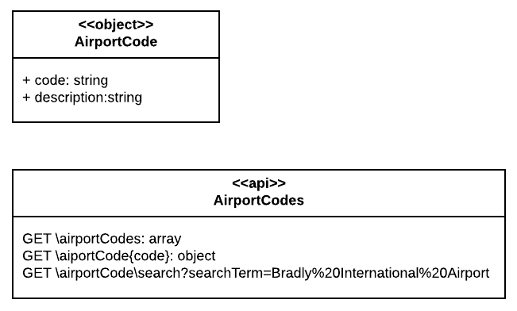

# Airport Codes

A project that demonstrates how to use Swagger to generate an API.

The Airport code is based on the following model.

The project is a RESTful API specified under OpenAPI 2.0 using [SwaggerHub](https://app.swaggerhub.com/apis/breselman/GoodAirportCodes/0.0.9).

